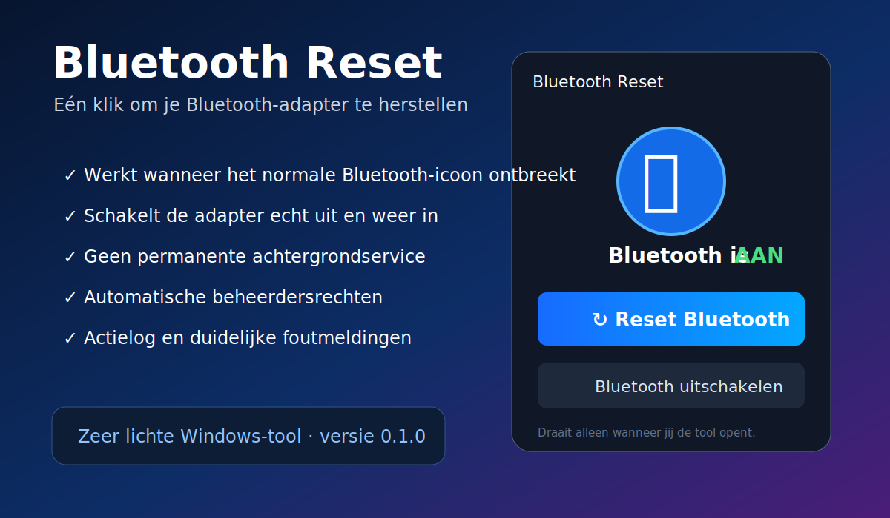

# Bluetooth Reset

Lichte Windows-tool waarmee je de fysieke Bluetooth-adapter met één klik uitschakelt en opnieuw inschakelt. Handig wanneer het normale Bluetooth-icoon verdwijnt of apparaten niet meer verbinden.



## Functies

* Detecteert automatisch `Intel(R) Wireless Bluetooth(R)`
* Reset de adapter met één knop
* Kan Bluetooth volledig aan of uit zetten
* Vraagt automatisch om beheerdersrechten
* Draait alleen wanneer je de tool opent
* Schrijft acties en fouten naar `logs/bluetooth-reset.log`

## Starten

Dubbelklik op:

```text
Start Bluetooth Reset.bat
```

Voor een zelfstandige `.exe` dubbelklik je één keer op:

```text
Build Windows App.bat
```

Daarna staat het programma in:

```text
dist\Bluetooth Reset.exe
```

## Techniek

De tool gebruikt de ingebouwde Windows-opdrachten `Get-PnpDevice`, `Disable-PnpDevice` en `Enable-PnpDevice`. Er wordt geen eigen driver of permanente achtergrondservice geïnstalleerd.
